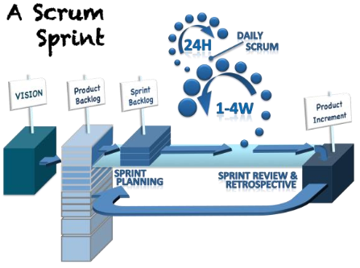

# The Scrum (Summary)

## 1. Purpose
Scrum is a framework for developing, delivering, and sustaining complex products.

Scrum thrives best in an environment where well-considered experimental discovery is combined with fact-based decisions.

Scrum thrives best in an organizational culture characterized by the courage to act in the moment, to change direction as needed, supported by knowledge and evidence reflecting reality, no matter what that reality or the hard truth is. 

Scrum thrives best in a culture that values knowledge from actual experience more than a predictive plan and self-generated or imaginary ‘facts’.

## 2. Definition
Consists:
1. Scrum Team;
2. Roles;
3. Events;
4. Artifacts;
5. Rules.

## 3. Uses    
Initially developed for managing and developing products, and has been used extensively to:

1. Research and identify viable markets, technologies, and products capabilities;
2. Develop products and enhancements;
3. Release products and enhancements, as frequently as many times per day;
4. Develop and sustain Cloud (online, secure, on-demand) and otheroperational environments for product use; and,
5. Sustain and renew products.

Scrum proved especially effective in iterative and incremental knowledge transfer.

The essence of  Scrum is a small team of people.

## 4. Theory
Scrum is founded on empirical process control theory, or empiricism.
Three pillars uphold every implementation of empirical process control:

1. **Transparency**:
    Significant aspects of the process must be visible to those responsible for the outcome.
        
    For example:
    * A common language refering to the process must be shared by all participants; and,
    * Those performing the work and those inspecting the resulting increment must share a common definition of "Done".
    
    
2. **Inspection**:
Scrum users must frequently inspect Scrum artifacts and progress toward a Sprint Goal to detect undesirable variances. Their inspection should not be so frequent that inspection get in the way of the work. Inspections are most beneficial when diligntly performed by skilled inspectors at the point of work.

3. **Adaptation**:
If an inspector determines that one or more aspects of a process deviate outside acceptable limits, and that the resulting product will be unacceptable, the process or the material being processed must be adjusted. An adjustment must be made as soon as possible to minimize further deviction.

## 5. Values
1. Commitment;
2. Courage;
3. Focus;
4. Openness;
5. Respect.

When the values of commitment, courage, focus, openness and respect are embodied and lived by the Scrum Team, the Scrum pillars of transparecy, inspection, and adaptation come to life and build trust for everyone. The Scrum Team members learn and explore those values as they work with the Scrum roles, events, and artifacts. 

Successful use of Scrum depends on people becoming more proficient in living these five values.

## 6. The Scrum Team

 Consists:
 1. Product Owner;
 2. Development Team;
 3. Scrum Master.

 Scrum Teams are self-organized and cross-functional.
 
 Self-organizing teams choose how best to accomplish their work, rather than being directed by others outside the team.

 Cross-functional teams have all competencies needed to accomplish the work without depending on others not part of the team.

 Scrum Teams deliver products iteratively and incrementally, maximizing opportunities for feedback.

 **The Product Owner** is responsible for maximizing the value of the product resulting from work of the *Development Team*.
 
 The Product Owner is the sole person responsible for managing the *Product Backlog*.

 The Product Owner is one person, not a committee. The Product Owner may represent the desires of a committee in the  Product Backlog, but those wanting to change a Product Backlog item's priority must address the Product Owner.

 **The Development Team** consists of professionals who do the work of delivering a potentially releasable increment of "Done" product at the end of each Sprint.

 Development Team size is betweem 3 and 9.

 Fewer than three Development Team members decrease interaction and results in smaller productivity gains.

 Having more than nine members requires too much coordination.

 The Product Owner and Scrum Master roles are not included in this count unless they are also executing the work of the Sprint Backlog.

**The Scrum Master** is responsible for promoting and supporting Scrum helping 
everyone understand Scrum theory, practices, rules and values.

The Scrum Master is a servant-leader for the Scrum Team.

**The Scrum Master => the Product Owner**

The Scrum Master servers the Product Owner in several ways, including:

* Ensuring that goals, scope, and product domain are understood by everyone on the Scrum Team as well as possbile;
* Finding techniques for effective Product Backlog management;
* Helping the Scrum Team understand the need for clear and concise Product Backlog items;
* Understanding product planning in an empirical environment;
* Ensuring the Product Owner knows how to arrange the Product Backlog to maxime value;
* Understanding and practicing agility; and,
* Faciliting Scrum events as requested or needed.

**The Scrum Master => the Development Team**

The Scrum Master servers the Development Team in several ways, including:

* Coaching the Development Team in self-organization and cross-functionality;
* Helping the Development Team to create high-value products;
* Removing impediments to the Development Team's progress;
* Faciliting Scrum events as requested or needed; and,
* Coaching the Development Team in organizational environments in wich Scrum is not yet fully adopted and understood.

**The Scrum Master => the Organization**

The Scrum Master servers the Organization in several ways, including:

* Leading and coaching the organization in its Scrum adoption;
* Planning Scrum implementations within the organization;
* Helping employees and stakeholders understand and enact Scrum and empirical product development;
* Causing change that increases the productivity of the Scrum Team; and,
* Working with other Scrum Masters to increase the effectiveness of the application of Scrum in the organization.

## 7. Scrum Events

The Scrum events are:
* Sprint:

    is time-boxed of one month, or less. A new Sprint starts immediately after the conclusion of the previous Sprint.

* Sprint Planning:

    is time-boxed to maximum of eight hours for a one-month Sprints. For shorter Sprints, the event is usually shorter.

* Sprint Review:

    is time-boxed to four-hour for one-month Sprints. For shorter Sprints, the event is usually shorter.

* Sprint Retrospective:

    is time-boxed to three-hour for one-month Sprints. For shorter Sprints, the event is usually shorter.

* Daily Scrum:

    is a 15 minutes time-boxed event for the Development Team.

All events are time-boxed events, such that every event has a *maximum* duration.
    
Once a Sprint begins, its duration is fixed and cannot be shortened or lengthened.

The remaining events may end whenever the purpose of the events is achieved.

## 8. Scrum Artifacts

Consists:

* Product Backlog;
    is an ordered list of everything that is known to be needed in the product.

* Sprint Backlog;
    is the set of Product Backlog items selected for the Sprint, plus a plan for develiring the product increment and realizing the Sprint Goal.

* Increment.
    is the sum of all the Product Backlog items completed during a Sprint and the value of incrments of all previous Sprint. 

*Reference:*
https://www.scrum.org/resources/scrum-guide

https://scrumorg-website-prod.s3.amazonaws.com/drupal/2016-06/Empirical-Management-Explored.pdf
